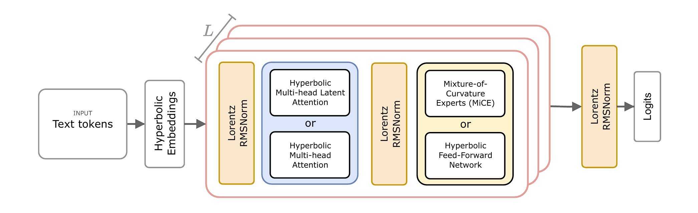
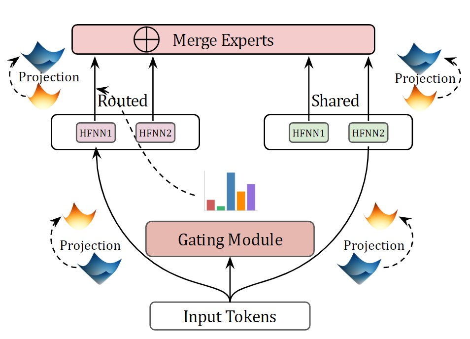
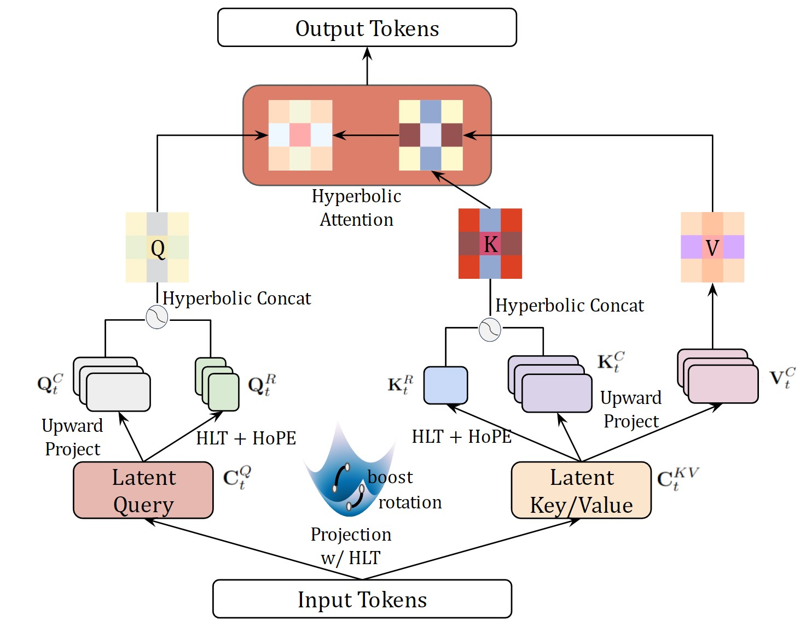

<div align="center">

# Hyperbolic Large Language Models via Mixture of Cruvature Experts

[](https://arxiv.org/abs/2505.24722)
[](./LICENSE)
<!-- [](https://papers.nips.cc/paper/2020) -->
</div>

## Description

Official source code of HELM, a family of fully **H**yp**E**rbolic Large **L**anguage **M**odels (LLMs) consisting of two variants:
- HELM-MiCE: hyperbolic LLMs with an Mixture of Experts (MoE) module where each experts operate in a distinct curvature space to learn fine-grained token geometry
- HELM-D: hyperbolic dense LLMs to better align with hierarchical structures in token embedding distribution
### Model Framework


### Mixture of Curvature Experts (MiCE)
<p align="center">

<p>
The Mixture of Curvature Experts (MiCE) module is a hyperbolic MoE module that enables each experts to each operate on a distinct curvature space, so the the experts can collectively learn more fine-grained geometric structures in the token distributions. The routing is also sepcifically designed to reflect the geometric structure of the space. Please see our [paper](https://arxiv.org/abs/2505.24722) for techinical details.

### Hyperbolic Multi-Head Latent Attention (HMLA)
<p align="center">

<p>
The HMLA module, similar to the Euclidean Multi-Head Latent Attention, is designed specifically for hyperbolic LLMs so that the model only needs to save the latent keys and values during generation. By projecting the original keys and values to a lower-dimensional subspace, HMLA significantlly reduces the memory footprint of the KV-cache.

## Installation

#### Pip

```bash
# [OPTIONAL] create virtual environment
python3.10 -m venv helm_env
source helm_env/bin/activate

# install requirements
bash setup_training.sh
```

## How to run
The training is handled solely via the ***train.py*** file. We use sample packing enabled by the LLM-Foundary library, with a packing ratio of 3.0. The models are trained on the English portion of the [Wikipedia dataset](https://huggingface.co/datasets/wikimedia/wikipedia), tokenized by the [LLaMA3.1-8B tokenizer](https://huggingface.co/meta-llama/Llama-3.1-8B).

To train the models with the default config, please first prepare the dataset for training by run the following command:

```bash
python3 helm/utils/prep_data.py
```

Then the models can be trained using the scipts found in the [example folder](./example). For example, to train the 120M parameter HELM-MiCE model as did in the paper, please run 

```bash
bash example/train_mice_120M.sh
```

If you wish to train your own hyperbolic LLM, you can override the parameters from the command, with the following options:
```
training_config: 
    --train 
        If true, MiCE model will return information for load balancing
    --min_lr_ratio
        ratio between final target learning rate and initial learning rate
    warm_up_ratio
        percent of steps to use as warm up
    seed 
        random seed
    lr
        initial learning rate
    weight_decay
        which optimizer to use, can be any of [Adam, RiemannianAdam]
    packing_ratio
        how many samples to pack into one bin for sample packing
    gradient_accumulation_steps
        how many steps to update gradients for accelerator
    CHECKPOINT_DIR
        where to save the model
    log_dir
        where to log training dynamics
    data_path
        path to data
    model_name
        One of HELM_D or HELM_MiCE
    find_unused_parameters
        whether the accelerator should find unused parameters
    max_batch_size
        Maximum batch size
    max_seq_len
        Maximum sequence length
    project_emb
        If true, the model will map tokens to space-like dimension of Lorentz vectors
    vocab_size
        Vocabulary size of the tokenizer

model_config
    dim
        Model dimension
    inter_dim
        Intermediate dimension for MLP layers
    mice_inter_dim
        Intermediate dimension for MoE layers
    n_layers
        Number of transformer layers
    n_dense_layers
        Number of dense layers in the model
    n_heads
        Number of attention heads
    n_routed_experts
        Number of routed experts for MiCE layers
    n_shared_experts
        Number of shared experts for MiCE layers
    n_activated_experts
        Number of activated experts in MiCE layers
    n_expert_groups
        Number of expert groups
    n_limited_groups
        Number of limited groups for MiCE routing
    score_func
        Scoring function for MiCE routing
    route_scale
        Scaling factor for routing scores
    bias_update_speed
        How much to update the bias for gating to ensure expert load balancing
    seq_bal_alpha
        Scaling for sequence load balancing loss
    train_curv
        If true, sets the curvatures of the experts as trainable
    q_lora_rank
        LoRA rank for query projections
    kv_lora_rank
        LoRA rank for key-value projections
    qk_nope_head_dim
        Dimension for query-key projections without positional embeddings
    qk_rope_head_dim
        Dimension for query-key projections with rotary embedding
    v_head_dim
        Dimension for value projections
    original_seq_len
        Original sequence length
    rope_theta
        Base for rotary positional encoding
    rope_factor
        Scaling factor for extended sequence length
    beta_fast
        Fast beta correction factor
    beta_slow
        Slow beta correction factor
    arch
        model architecture for HELM-D, given by La_Wb_Ac, where a is number of layers, b is model dimension, and c is number of heads
```

***Rminder to ***access_token*** variable in the corresponding files to load the correct tokenizer.***

### Reusing Hyperbolic LLM Modules
To reusme HELM modules, please check the [./helm folder](./helm). For example, the MiCE module is in the [mice.py file](./helm/modules/mice.py).

## Acknolwedgement
This project heavily relies on the the following libraries. We thanks the authors for their awesome contributions
-[HyperCore](https://github.com/Graph-and-Geometric-Learning/HyperCore)
-[Accelerate](https://github.com/huggingface/accelerate)
-[LLM Foundry](https://github.com/mosaicml/llm-foundry)
-And [LM Evaluation Harness](https://github.com/EleutherAI/lm-evaluation-harness) for evaluation results

## License
This project is licensed under the MIT License - see the [LICENSE file](./LICENSE) for details.
